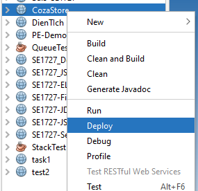
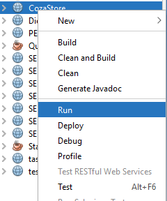

# Dự án làm website bán quần áo
Dự án nhỏ sử dụng java, sql server, jsp, css, javascript để tạo một website bán hàng

# Yêu cầu
- Cài đặt java:  [Hướng dẫn cài đặt](https://drive.google.com/drive/folders/1-s13Ue6RkjYmTkO-G5sapRwQRa0Uldw4?fbclid=IwAR2E3S3LyuVYByc9R-5mea4jqW4fFwYTaRCmH2hQgmPmcOSd6mDmfsxza_M)

# Chạy chương trình
- Sau khi cài đặt xong netbean, apache và jdk, click chuột phải vào project và rồi ấn Deploy:

- Sau đó ấn vào Run để chạy chương trình

    
