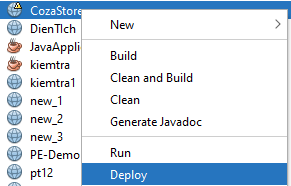
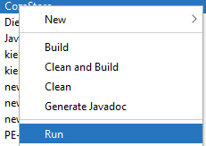

# Project: Clothes shop (Name: CozaStore)
This is my small project to practice java, SQL Server, JavaScript.
In this project, i was used library Java mail to send email, chartJS to build statistics to admin, 

# Requirement
- Set up java:  [Installation guide](https://drive.google.com/drive/folders/1-s13Ue6RkjYmTkO-G5sapRwQRa0Uldw4?fbclid=IwAR2E3S3LyuVYByc9R-5mea4jqW4fFwYTaRCmH2hQgmPmcOSd6mDmfsxza_M)

# Run program
- After installed netbean, apache and jdk, click in project and choose deploy:

- After that, click Run to start the project

    

- Install Sql Server: [Install Sql Server](https://www.thegioididong.com/game-app/huong-dan-cai-dat-sql-server-2019-cuc-don-gian-chi-1312926)
- After install sql Server, you need to run file: cozastore.sql

